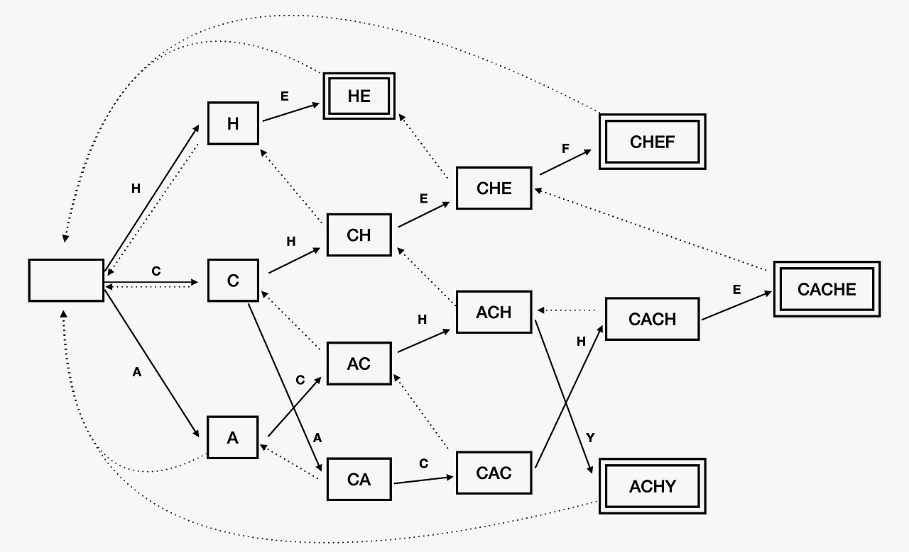

# 아호 코라식(Aho-Corasick)

<br>

> ### 개념

<br>

#### 1.아호 코라식 알고리즘
아호 코라식 알고리즘은 일대다 문자열 매칭 알고리즘이다. <br>
일대일 문자열매칭인 KMP 알고리즘이 문자열과 하나의 패턴을 비교한다면 <br>
아호코라식 알고리즘은 다수의 패턴을 트라이 구조로 하여 집합 패턴에 대한 검색을 진행한다. <br>
그렇기 때문에 KMP 알고리즘과 트라이 자료구조에 대한 이해가 필요하다.

#### 2.구조 비교
parent : "CACACHEFCACHY", patterns = ["CACHE", "HE", "CHEF", "ACHY"]에 대한 것을 <br>
아래에 트라이 구조와 KMP 알고리즘의 실패함수를 그린 자료이다.

[다수의 패턴에 대한 KMP 알고리즘의 실패함수]
<br>


<br>

[트라이 구조의 실패함수]
<br>


중복 데이터를 합쳐 한번의 탐색으로 KMP 알고리즘을 여러번 실행한 것과 비슷한 효과를 만들 수 있다.
- 실선은 패턴으로 가는 성공, 점선은 실패 링크를 의미한다.

<br>

> ### 구현

<br>

#### 1.트라이 구조 만들기
우선 찾을 모든 문자 패턴을 트라이 구조로 구현하여 실패링크를 만들기 위한 사전 준비를 한다.
```java
class TrieNode {

    Map<Character, TrieNode> child = new HashMap<>();
    TrieNode fail;
    List<Integer> output = new ArrayList<>();   // 패턴의 마지막 문자열인지 확인

    public TrieNode() {
        this.fail = null;
    }
}

class Trie {

    TrieNode root;

    List<String> patterns;

    public Trie(List<String> patterns) {
        this.root = new TrieNode();
        this.patterns = patterns;
        for (String pattern : patterns) {
            addPattern(pattern);
        }
        failure();
    }

    public void addPattern(String pattern) {
        TrieNode current = root;

        for (char c : pattern.toCharArray()) {
            if (current.child.get(c) == null) {
                current.child.put(c, new TrieNode());
            }
            current = current.child.get(c);
        }

        current.output.add(patterns.indexOf(pattern));  // 해당 패턴 인덱스 저장
    }
}
```

<br>

#### 2.실패링크 만들기
중복되는 문자열 중 짧은 문자열부터 계산하여, 가장 긴 문자열 부터 순차적으로 더 짧은 문자열을 가리키도록 실패 링크를 연결해 나간다. <br>
BFS로 구현하여 실패링크를 만들어가면 문자열이 짧은 순서로 계산을 해나가기 때문에 필요한 모든 실패링크는 계산이 완료 되어있다. <br>
부모의 실패 링크에 현재의 글자가 있다면 연결, 없다면 한단계 상위의 실패링크의 자식 탐색의 반복을 통해 연결한다.
```java
// class Trie

public void failure() {
    LinkedList<TrieNode> queue = new LinkedList<>();
    root.fail = null;

    // root children의 fail을 root로 설정
    for (Map.Entry<Character, TrieNode> entry : root.child.entrySet()) {
        entry.getValue().fail = root;
        queue.offer(entry.getValue());
    }


    while(!queue.isEmpty()) {
        TrieNode current = queue.poll();

        for (Map.Entry<Character, TrieNode> entry : current.child.entrySet()) {
            char c = entry.getKey();
            TrieNode childNode = entry.getValue();

            // 실패 노드에 다음 올 문자가 없으면 계속 찾음
            TrieNode failNode = current.fail;
            while (failNode != null && !failNode.child.containsKey(c)) {
                failNode = failNode.fail;
            }

            if (failNode == null) {
                childNode.fail = root;
            } else {
                childNode.fail = failNode.child.get(c);
                childNode.output.addAll(childNode.fail.output);
            }

            queue.offer(childNode);
        }
    }
}
```

<br>

#### 3.검색
문자열을 순회하며 해당 노드가 패턴의 마지막 글자인지 확인인 경우 List.add 진행 <br>
자식 노드에 찾는 문자가 없는 경우 실패링크를 참조한다.
```java
public static ArrayList<Integer> search(String text, Trie trie) {
    TrieNode node = trie.root;
    ArrayList<Integer> matches = new ArrayList<>();

    for (int i = 0; i < text.length(); i++) {
        char c = text.charAt(i);

        // 현재 문자에 대해 실패 링크를 따라가며 트라이를 탐색
        while (node != null && !node.child.containsKey(c)) {
            node = node.fail;
        }

        if (node == null) {
            node = trie.root;
            continue;
        }

        node = node.child.get(c);

        // 현재 노드에서 매칭되는 패턴이 있으면 output 리스트에 저장된 패턴 인덱스 출력
        if (!node.output.isEmpty()) {
            for (int patternIndex : node.output) {
                System.out.println("Pattern found: " + trie.patterns.get(patternIndex) + " at index " + (i - trie.patterns.get(patternIndex).length() + 1));
                matches.add(patternIndex);
            }
        }
    }

    return matches;
}
```

*****
#### 참고

###### [블로그] [[알고리즘] 다중 문자열 검색 아호 코라식(Aho-Corasick) 알고리즘 정리 (Java)](https://loosie.tistory.com/587)

###### [블로그] [[알고리즘] 아호 코라식(Aho-Corasick) 알고리즘] (https://pangtrue.tistory.com/305)

